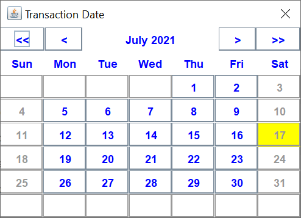
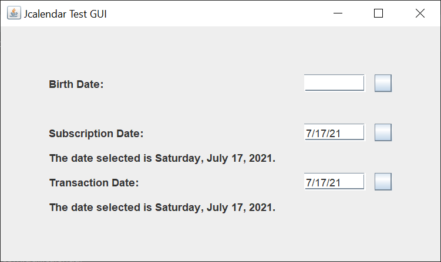
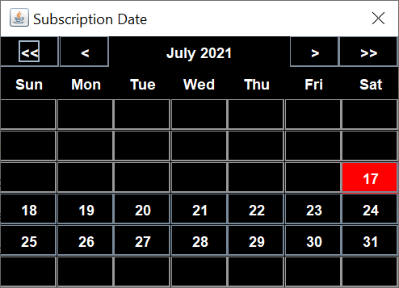
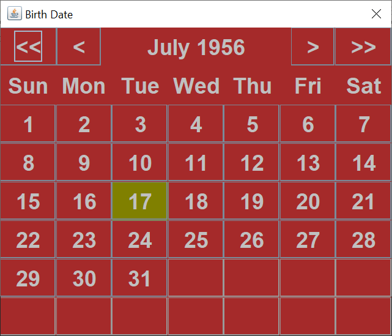

# Another JCalendar

## Introduction

I decided to create my own Java Swing JCalendar JDialog component.  This is what the component looks like, without using any of the optional color or font methods.  I did exclude Saturday and Sunday from being selected.

The << button displays the prior year.

The < button displays the prior month.

The > button displays the next month.

The >> button displays the next year.

Left-click on a day button to select a date.  Left-click on the X in the upper right to cancel selecting a date.

The JCalendar component has several optional parameters.  You may:

- Change the panel background color.
-	Change the panel foreground color.
-	Change the calendar day highlight color.
-	Change the font.
-	Change the month names, to accommodate other languages.
-	Change the start day of the week. The default is the DayOfWeek SUNDAY.
-	Change the three letter day of the week names, to accommodate other languages and other start days of the week.
-	Exclude week days from being selected.
-	Set the earliest valid date for selection.
- Set the latest valid date for selection.

I also created a test GUI, so I could test the JCalendar and so I could give an example or three of how to use the JCalendar.

Here's the text GUI.  The square buttons to the right of the text fields bring up the JCalendar JDialog.

Here's the JCalendar with alternate colors and an earliest date of today.  I like this color scheme.

Here's the JCalendar with alternate colors and a larger font for us older folks.

## Explanation

If you’re not familiar with Java Swing, Oracle has an excellent tutorial to get you started, [Creating a GUI With JFC/Swing](https://docs.oracle.com/javase/tutorial/uiswing/index.html). Skip the Netbeans section.

The JCalendar is a JDialog with a main JPanel.  The main JPanel uses a GridBagLayout to place two subordinate JPanels, the title JPanel and the calendar JPanel.

The title JPanel uses a GridBagLayout to hold the four JButtons and a JLabel.  This is so I can place the JButtons on the left and the right, while allowing the maximum amount of space for the month and year JLabel.

The calendar JPanel uses a GridLayout to layout the weekday names and the days of the month.

I create the title JPanel and the calendar JPanel one time.  I update the text of the Swing components to display different months.
